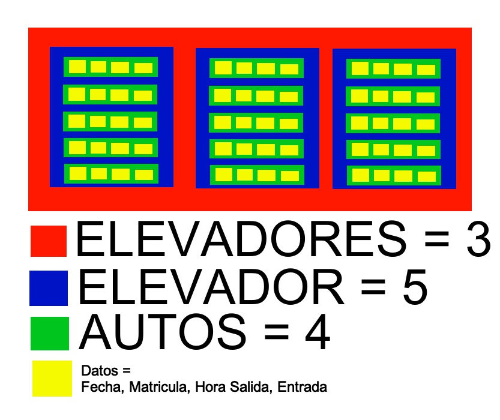

# Elevadores TJ EDA

Una empresa tiene 3 elevadores para estacionamiento de aytos y desea automatizar el proceso de ingreso y retiro de autos a lo mismos.

Cada elevador tiene capacidad para 5 autos y por cada auto que lo utiliza, se require conocer lo siguiente:

  1. Fecha
  2. El número de auto
  3. Hora de ingreso
  4. Hora de salida

Datos que se asignarán automáticamente cuande se ingrese or retire un auto.

## Opciones del Sistema

| Opción | Condiciones y/o restricciones |
| ----- | ---- |
| 1. Ingresar auto | Solicitar al usuario el número de elevador y verificar que haya espacio disponible; en caso de haber espacion, agregar el auto y desplegar el número del elevador, el numero que ocupa en el elevador, fecha y hora de ingreso. En caso de no haber espacio en el elevador indicado, ofrecer otro que este disponible y preguntar si desea asignar el auto a ese elevador ofrecido, en caso afirmativo agregar el auto y desplegar el número del elevador, el número que ocupa en el elevador, fecha y hora de ingreso. Despues de asignar el auto y desplegar la informacion, verificar si el elevador se llenó y de ser así desplegar la información solicitada en la opción 3 del menú. |
| 2. Retirar auto | Solicitar al usuarl el número del elevador del cual se retirará el auto. Verificar que no se encuentre vació ese elevador elegido. En caso de retirar un auto, desplegar el numero del elevador, elnúmero que ocupaba en el elevador ,fecha, hora de ingreso y hora de salida. |
| 3. Autos por elevador | Solicitar al usuario el número del elevador del cual desea ver la información de los autos En caso de que tenga autos, desplegar el número del elevador, elnúmero que ocupa cada auto en el elevador, fecha y hora de ingreso. |
| 4. Autos Totales | Desplegar el total de autos por toso los elevadores, y pro cada elevador, la cantidad de autos que tiene. |
| 5. Salir | Será la única opcion para salir del programa | 

## Condiciones y/o restricciones generales

  1. Después de desplegar los resultados en cada una de las opciones (1-4), preguntar al usuario si desea realizar otra acción, de ser así, se repite el proceso, de lo contrario, se regresa al menú principal.
  2. Todos los valores ingresados, deberán ser validados.
  3. Enviar los mensajes correspondientes para cada excepción controlada.

